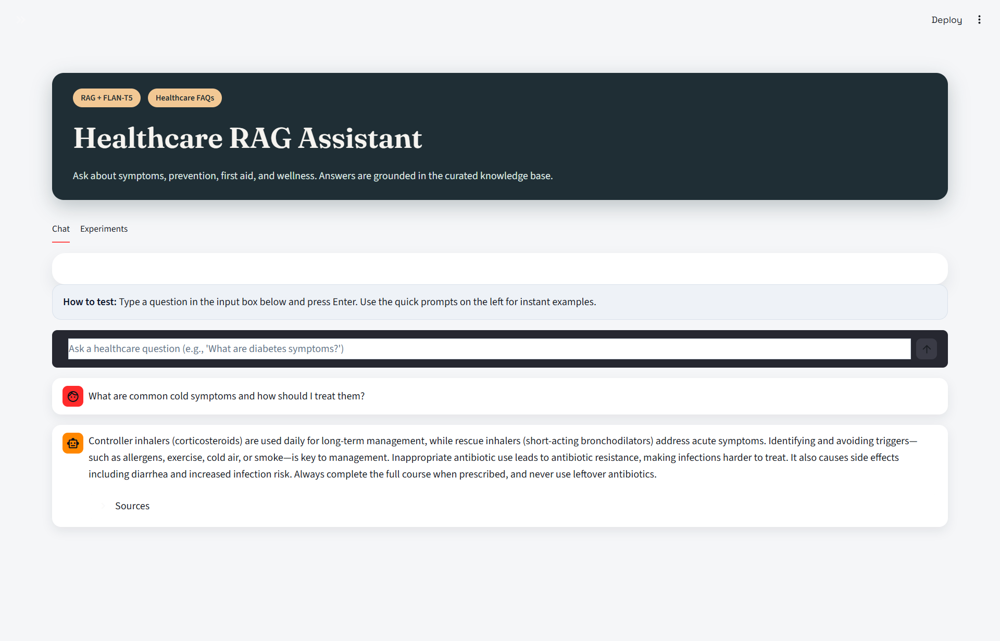
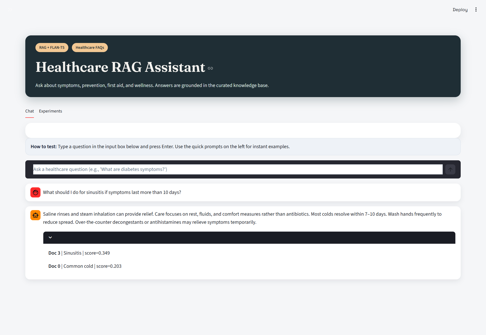
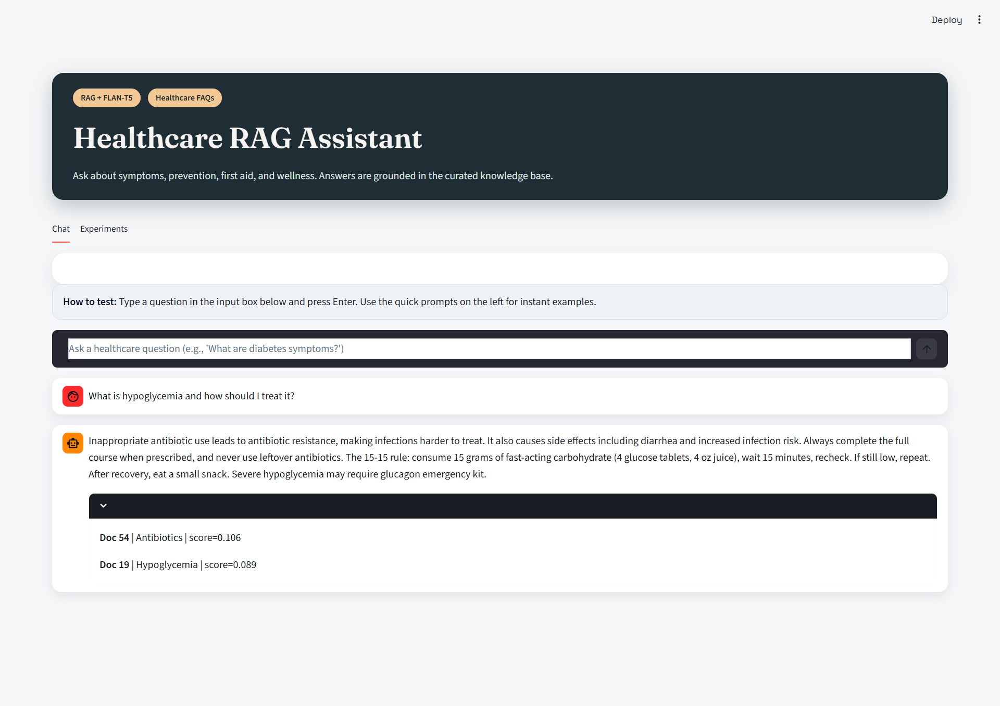

# Domain-Specific Chatbot Using RAG for Healthcare FAQs

A domain-specific Retrieval-Augmented Generation (RAG) chatbot for healthcare FAQs. It uses TF-IDF + cosine similarity for retrieval and FLAN-T5-base for generation, with a CLI loop and a Streamlit UI.

## Features
- TF-IDF retrieval with bigrams and cosine similarity
- Open-source FLAN-T5-base text2text generation
- Topic-tagged knowledge base with optional filtering
- Similarity threshold fallback for low-confidence answers
- Streamlit UI with sources and experiments dashboard
- CLI interactive loop for quick testing

## Tech Stack
- Python 3.8+
- scikit-learn (TfidfVectorizer, cosine_similarity)
- HuggingFace Transformers (pipeline text2text-generation)
- PyTorch backend (via transformers)
- Streamlit UI

## Architecture (RAG Flow)
User Query → TF-IDF Retriever → Top-k Chunks → Prompt Builder → FLAN-T5 → Response

Key controls:
- `top_k`: how many chunks are retrieved (higher can add noise)
- `max_tokens`: response length (higher = more descriptive)

## Interview Summary (Crisp)
This is a domain-specific RAG chatbot where TF-IDF + cosine similarity retrieves top-k relevant chunks from a text knowledge base, and FLAN-T5-base generates a grounded answer using that context.

## Project Structure
rag_chatbot/
  app.py
  chatbot.py
  healthcare_data.txt
  requirements.txt
  convert_hub_to_kb.py

## Setup
1. Create a virtual environment (optional but recommended).
2. Install dependencies:
   pip install -r rag_chatbot/requirements.txt

## Quick Start (Streamlit)
1. Start the app:
  streamlit run rag_chatbot/app.py
2. Ask a question in the input box (bottom of the chat panel).

Example prompts:
- What are common cold symptoms and how should I treat them?
- How can I lower high blood pressure naturally?
- What are the warning signs of a stroke?
- What should I do for a minor burn?

## Run the Streamlit App
streamlit run rag_chatbot/app.py

## Run the CLI Chatbot
python rag_chatbot/chatbot.py

## Output

## Configuration
- `top_k`: Number of chunks retrieved (higher = more context, but can add noise)
- `max_tokens`: Response length (higher = more descriptive answers)
- `min_score`: Similarity threshold for fallback (lower = more answers, higher = stricter)

## Knowledge Base Updates
The knowledge base uses one paragraph per topic, separated by a blank line. Each entry can use:
`Topic: <name> | <content>`

If you have the HTML knowledge hub file, you can regenerate the KB:
python rag_chatbot/convert_hub_to_kb.py --input healthcare_knowledge_hub.html --output rag_chatbot/healthcare_data.txt

## Troubleshooting
- If Streamlit fails on `text2text-generation`, ensure transformers is < 5.0:
  pip install -U "transformers<5.0.0"
- If the app is slow on first run, the FLAN-T5 model is downloading and caching.

## Notes
- The knowledge base is stored in healthcare_data.txt with paragraphs separated by blank lines.
- Each paragraph can start with a Topic: header for filtering in the UI.

## License
MIT
